# ARCHITECTURE

Last updated: 2026-04-05 (workflow diagram refresh for report Section 3.4)

This document is the technical deep dive for the STEM Learning Platform with GenAI. It complements `DESIGN.md`: `DESIGN.md` explains the broad product and system story, while this document goes deeper on runtime structure, subsystem boundaries, request flows, background jobs, and implementation tradeoffs.

## 1. Reading Guide

Use this document when you want to understand:

- how the platform is split across frontend, backend, and Supabase
- where major workflows execute
- how request and data flows move through the stack
- how background jobs, guest mode, and analytics are implemented
- which architectural decisions shape reliability, safety, and maintainability

## 2. System Context

At a high level, the project is a role-aware educational platform with three runtime surfaces:

- a Next.js web app for user experience, routing, and server actions
- a Python FastAPI service for AI orchestration and workflow-heavy backend logic
- a Supabase project for auth, data, storage, row-level security, and background-job support

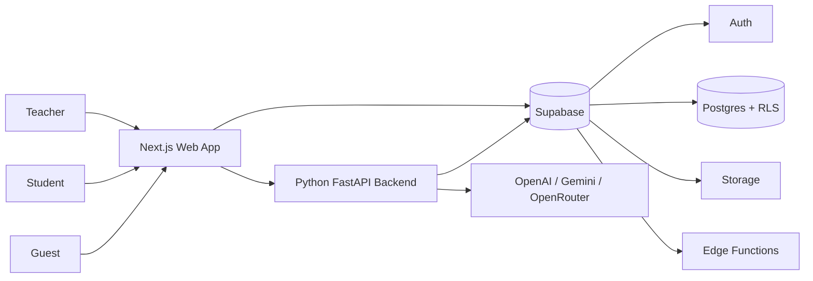

### Architectural intent

- Keep UI and route orchestration in the web layer.
- Keep provider logic, AI workflows, and service guardrails in the Python backend.
- Keep identity, persistence, access control, storage, and async work coordination in Supabase.

## 3. Repository And Ownership Structure

The monorepo is intentionally partitioned by subsystem.

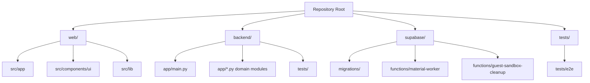

### Core ownership by directory

| Area | Main responsibility |
| --- | --- |
| `web/` | UI, server actions, route handlers, role-based flows, guest-aware routing |
| `backend/` | AI generation, chat orchestration, analytics, class workflows, guest AI guardrails |
| `supabase/` | schema, RLS, queueing, edge functions, guest sandbox data model |
| `tests/` | Playwright E2E coverage for high-level user flows |

## 4. Runtime Topology

The deployed system is not just “frontend plus database”. It is a coordinated multi-surface application.

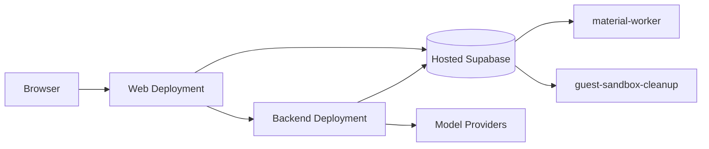

### Why this split matters

- The frontend can stay focused on product flows and rendering.
- The backend can evolve independently around AI logic, validation, and orchestration.
- Background processing is handled outside the request-response path.
- Guest-mode cleanup and material processing remain operational concerns, not UI concerns.

## 5. Request Flow Model

Most important product operations follow the same layered pattern.

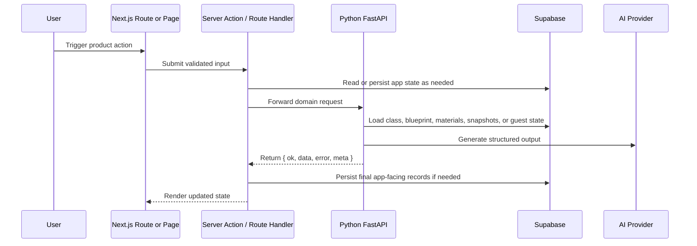

### Common responsibilities by layer

| Layer | Typical responsibilities |
| --- | --- |
| Web page/component | collect user input, render route state |
| Server action | authorization, validation, persistence choreography, backend calls |
| Python backend | AI orchestration, fallback, service logic, guest guardrails |
| Supabase | auth, storage, persistence, RLS, queue support, snapshots |

## 6. Web Layer Architecture

The web app uses Next.js 16 App Router with server actions as the main write path.

### Main responsibilities

- public landing and auth UX
- teacher and student dashboard routing
- class-shell navigation
- materials library UX
- Blueprint editor and publishing flows
- activity generation and assignment surfaces
- analytics and teaching-brief pages
- guest routing, gating, and presentation

### Key implementation files

| Path | Responsibility |
| --- | --- |
| `web/src/app/classes/actions.ts` | class-level server actions including class creation, joins, and materials flows |
| `web/src/app/classes/[classId]/blueprint/actions.ts` | blueprint generation, draft lifecycle, approval, and publish flows |
| `web/src/lib/actions/insights.ts` | teacher class intelligence action boundary |
| `web/src/lib/actions/teaching-brief.ts` | adaptive teaching brief action boundary |
| `web/src/app/components/Sidebar.tsx` | role-aware persistent navigation shell |
| `web/src/app/components/RoleAppShell.tsx` | top-level shell wrapper with guest banner handling |
| `web/src/lib/ai/python-*.ts` | frontend-to-backend adapters for AI domains |
| `web/src/lib/chat/python-workspace.ts` | frontend adapter for chat workspace endpoints |

### Auth Surface Architecture

The public auth entry flow — sign-in, sign-up, and forgot-password — is handled by a single shared component: `web/src/components/auth/AuthSurface.tsx`. It renders in two presentations, while password recovery completion intentionally lives on a dedicated page:

- **Modal** on the home page `/`, triggered by `?auth=sign-in`, `?auth=sign-up`, or `?auth=forgot-password` query params. `HomeAuthDialog` wraps it.
- **Page** at the dedicated routes `/login`, `/register`, and `/forgot-password`, all sharing `AuthShell.tsx` as their outer wrapper.
- **Recovery completion** at `/reset-password`, reached only after `/auth/confirm?type=recovery` verifies the reset link and establishes the recovery session cookie.

Auth state (pending email, resend timer, confirmation flow) is fully URL-driven — no separate client state. The sign-up form collapses to a resend-only surface after the confirmation email is sent; the two states are mutually exclusive and server-rendered via search params. Confirmation and recovery link failures redirect users to resend-ready states rather than dead-end error pages.

Auth URL and redirect helpers live in `web/src/lib/auth/ui.ts`; the server-side auth context helper is `web/src/lib/auth/session.ts`.

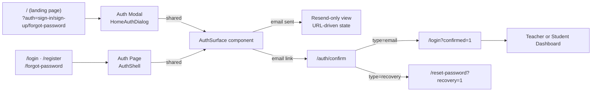

### Middleware role

`web/middleware.ts` centralizes route protection and guest-session enforcement.

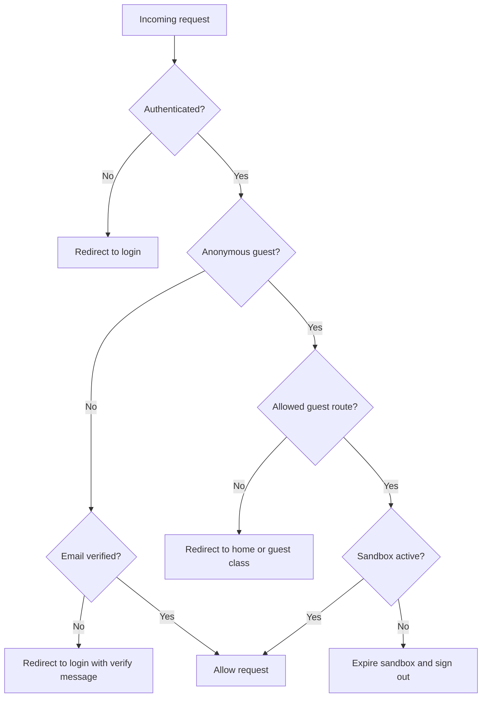

## 7. Python Backend Architecture

The Python backend is the sole AI orchestration boundary for the platform.

### Main structural pattern

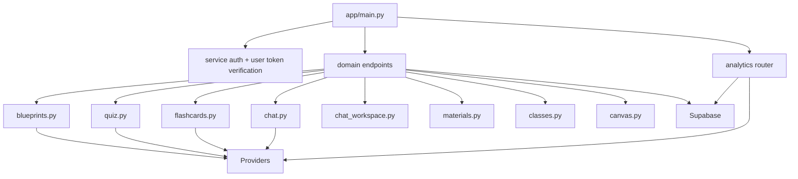

### Current backend domains

- generic LLM and embedding generation
- blueprint generation
- quiz generation
- flashcards generation
- grounded chat generation
- chat canvas generation
- chat workspace orchestration
- class creation and join
- material dispatch and processing triggers
- class intelligence, teaching brief, and data-query generation

### Service-level contracts

- The backend returns the canonical envelope `{ ok, data, error, meta }`.
- It injects and returns `request_id` values for observability and traceability.
- It validates service auth and, when required, validates real user bearer tokens against Supabase Auth.

## 8. Chat Workspace And Memory Architecture

Chat is one of the most sophisticated subsystems in the project. It is not a single stateless endpoint.

### Current responsibilities

- participant discovery for teacher monitoring
- session list, creation, rename, and archive
- paginated message history
- send-and-persist workflow
- long-context management and compaction
- grounded retrieval against blueprint and materials

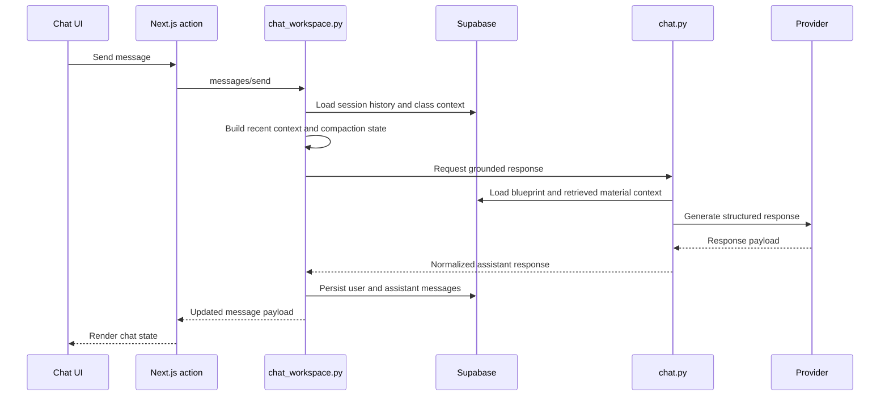

### Compaction logic

`backend/app/chat_workspace.py` shows that the chat workspace is tuned around:

- recent-turn windows
- context token budgets
- output token reservation
- compaction triggers
- cursor validation and pagination safety

This is a good example of moving complex conversational behavior into a dedicated backend subsystem rather than leaving it to route handlers in the web app.

## 9. Supabase Architecture

Supabase is the operational backbone of the platform.

### Main roles

- auth for permanent and guest users
- row-level secured Postgres data
- private materials storage
- snapshot storage for analytics
- queue-backed material processing
- guest sandbox state and lifecycle persistence
- edge-function execution

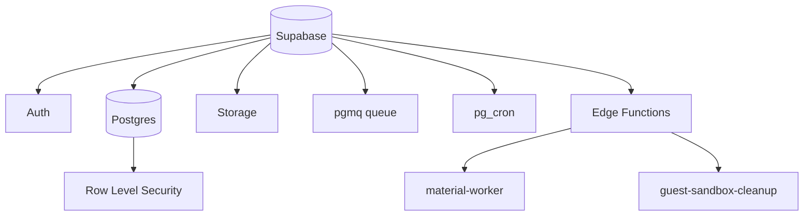

### Important data model themes

- `sandbox_id` enables guest-mode cloning and isolation across normal application tables.
- canonical blueprint snapshots provide stable downstream context.
- analytics and teaching-brief snapshots support teacher-facing refresh and caching behavior.
- assignment recipient and chat workspace tables support per-user classroom workflows.

## 10. Background Jobs And Async Processing

Material processing is intentionally asynchronous.

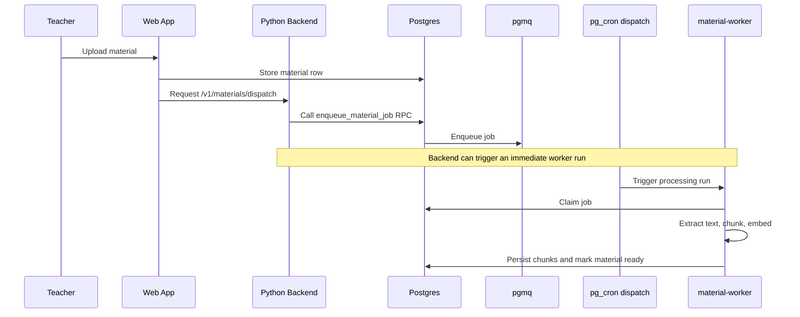

### Why async here

- extraction and embedding are not request-friendly operations
- worker failure and retry behavior can be managed independently
- the UI can reflect `processing`, `ready`, and `failed` states clearly

## 11. Guest Mode Architecture

Guest mode is implemented as a real sandboxed experience, not a presentation-only shortcut.

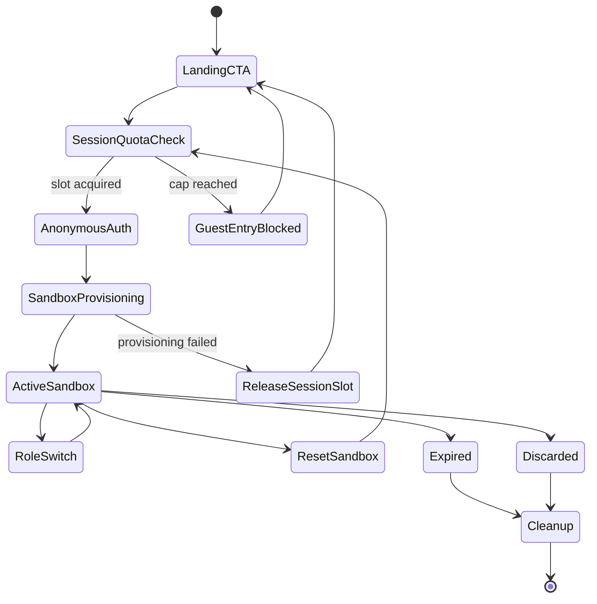

### Key implementation decisions

- Supabase Anonymous Auth creates a real guest identity.
- A sandbox row is created and seeded demo data is cloned into standard tables.
- The web layer constrains route scope and session lifetime.
- The backend verifies sandbox ownership and quotas before guest AI work runs.
- `guest-sandbox-cleanup` reclaims expired or discarded guest data.

## 12. Security, Auth, And RLS

Security is distributed across all three runtime surfaces.

### Web layer

- route protection
- email verification enforcement
- guest route confinement

### Backend layer

- service authentication through `PYTHON_BACKEND_API_KEY`
- user bearer token validation
- guest quota enforcement
- request envelope consistency

### Supabase layer

- row-level security policies
- teacher- and enrollment-based access control
- sandbox-aware data isolation for guest flows

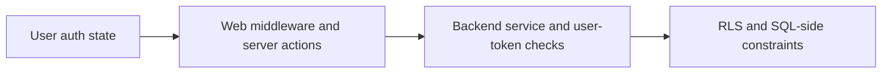

## 13. Deployment Architecture

The deployment model mirrors the runtime split:

- frontend deployment for `web/`
- backend deployment for `backend/`
- hosted Supabase project

This means operational failures can belong to:

- the frontend route and UX layer
- the backend orchestration layer
- Supabase auth, storage, data, or Edge Function layers

That separation is useful for debugging and for keeping each subsystem conceptually clean.

## 14. Main Tradeoffs And Constraints

### Strengths

- strong separation of concerns
- realistic async processing model
- credible guest demo path
- role-specific UX supported by role-specific architecture
- backend can evolve AI logic without reshaping frontend contracts

### Constraints

- the Python backend is a required runtime dependency
- material processing depends on queueing, worker secrets, and provider config alignment
- guest mode depends on both web config and Supabase anonymous auth
- the project intentionally favors architectural clarity over a single-deployment-surface simplification

## 15. Blueprint-Centered Operating Flow

This detailed workflow shows how the implemented platform turns teacher-owned classroom content into
a governed instructional loop. It is intentionally more explicit than the lightweight overview in
`README.md`, because it captures the real control points that matter to the product report:
background material readiness, blueprint publication, downstream activity gating, review, and
teacher response.

```mermaid
flowchart LR
    classDef teacher fill:#fef3c7,stroke:#b45309,color:#78350f,stroke-width:1.5px;
    classDef platform fill:#dbeafe,stroke:#1d4ed8,color:#1e3a8a,stroke-width:1.5px;
    classDef student fill:#dcfce7,stroke:#15803d,color:#14532d,stroke-width:1.5px;
    classDef insight fill:#ede9fe,stroke:#7c3aed,color:#4c1d95,stroke-width:1.5px;

    subgraph Teacher["Teacher Orchestration"]
        direction TB
        T1[Create class and<br/>upload materials]
        T2[Request blueprint generation<br/>from processed materials]
        T3[Edit draft approve<br/>and publish blueprint]
        T4[Generate activity drafts<br/>and create assignments]
    end

    subgraph Platform["Platform Processing and Control"]
        direction TB
        P1[Store files and material rows]
        P2[Python dispatches queue-backed<br/>material processing]
        P3[material-worker extracts text<br/>chunks and embeddings]
        P4[Indexed material context becomes<br/>retrieval-ready]
        P5[Retrieve indexed context and generate<br/>structured blueprint payload]
        P6[Persist blueprint snapshot topics<br/>objectives and version state]
        P7[Published blueprint gates grounded chat<br/>quiz flashcards and chat assignments]
        P8[Persist assignments submissions<br/>transcripts attempts and feedback]
        P9[Generate insights snapshots<br/>data-query visuals and teaching brief]
    end

    subgraph Student["Student Learning Experience"]
        direction TB
        S1[Join class and open<br/>student workspace]
        S2[Study published blueprint and use<br/>grounded open-practice chat]
        S3[Complete assigned quiz flashcards<br/>and chat activities]
    end

    subgraph Response["Teacher Review and Teaching Response"]
        direction TB
        R1[Review submissions save feedback<br/>and monitor class chat]
        R2[Inspect topic outcomes risk patterns<br/>and intervention suggestions]
        R3[Use adaptive teaching brief to choose<br/>the strongest next action]
        R4[Reassign support work or start<br/>the next blueprint iteration]
    end

    T1 --> P1 --> P2 --> P3 --> P4
    P4 --> T2 --> P5 --> P6 --> T3 --> P7
    P7 --> T4 --> P8
    P7 --> S1 --> S2 --> S3 --> P8
    P8 --> R1 --> R2 --> R3 --> R4
    P8 --> P9 --> R2
    R4 --> T4
    R4 --> T2

    class T1,T2,T3,T4 teacher;
    class P1,P2,P3,P4,P5,P6,P7,P8,P9 platform;
    class S1,S2,S3 student;
    class R1,R2,R3,R4 insight;
```

## 16. Related Docs

- [README.md](README.md) for project overview
- [DESIGN.md](DESIGN.md) for the broad product + system narrative
- [DEPLOYMENT.md](DEPLOYMENT.md) for rollout and operations
- [UIUX.md](UIUX.md) for design language and frontend implementation details
- [web/README.md](web/README.md) for frontend-specific notes
- [backend/README.md](backend/README.md) for backend-specific notes
- [supabase/README.md](supabase/README.md) for Supabase-specific notes
