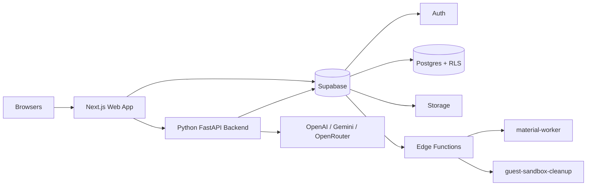
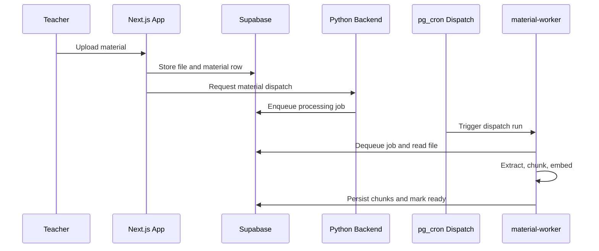
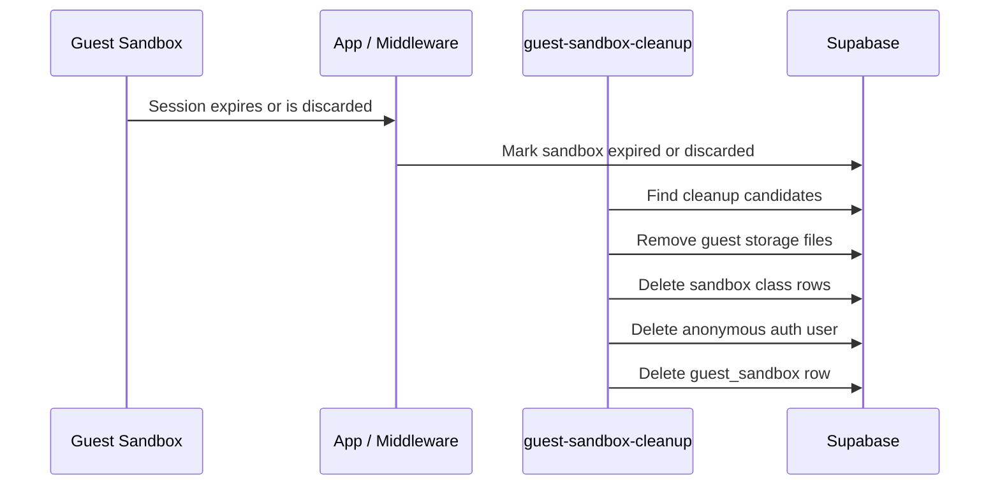

# Deployment Guide

This runbook describes the hosted deployment topology for the current project. The platform is not just a single Vercel app with a database. It is a coordinated deployment across a frontend, a separate Python backend, and a Supabase project with Edge Functions and background jobs.

## Deployment Topology



### Current Repo Reality

- `web/` is intended to deploy as the Next.js app.
- `backend/` is a separate FastAPI service and should be deployed independently from `web/`.
- The repository currently includes `.vercel` linkage in both `web/` and `backend/`, so two separate Vercel projects are a supported path.
- Supabase hosts:
  - Auth
  - Postgres
  - Storage
  - RLS policies
  - SQL functions and cron-backed queueing
  - Edge Functions for material processing and guest cleanup

## Environment Matrix

| Surface | Local | Preview / Staging | Production |
| --- | --- | --- | --- |
| Web app | `pnpm dev` from repo root | deployed build from `web/` | deployed build from `web/` |
| Python backend | `uvicorn app.main:app --app-dir backend --host 0.0.0.0 --port 8001 --reload` | separate hosted FastAPI service | separate hosted FastAPI service |
| Supabase | local stack or shared dev project | staging Supabase project | production Supabase project |
| Material jobs | local or staging queue worker | `material-worker` Edge Function | `material-worker` Edge Function |
| Guest cleanup | local/manual or staging function | `guest-sandbox-cleanup` Edge Function | `guest-sandbox-cleanup` Edge Function |

Use one aligned set of environments at a time. Preview web deployments should point to preview backend and preview Supabase, not a mix of preview and production surfaces.

## Prerequisites

- Node.js 20+
- `pnpm`
- Python 3.11+
- Supabase CLI
- Two hosted deployment targets for the app surfaces:
  - one for `web/`
  - one for `backend/`
- At least one configured AI provider

## 1. Create And Configure Supabase Projects

Create one project per hosted environment, typically:

- staging / preview
- production

### Required Supabase Auth Settings

- Email/password auth enabled
- Email confirmation enabled
- Phone auth disabled
- Anonymous sign-ins enabled if guest mode is required
- Site URL set to the canonical domain for that environment
- Redirect URLs include:
  - `http://localhost:3000/**`
  - your hosted web domain
  - your preview deployment wildcard if you use preview deployments

### Recommended Email Templates

The platform uses a branded confirmation email. Apply the full HTML from `supabase/templates/confirmation.html` in the Supabase Dashboard under **Auth → Email Templates → Confirm signup**. Do not use the default Supabase template — the branded one wires the confirmation button to the app's SSR callback route.

The URL patterns embedded in the templates are:

- Confirm signup:

```text
{{ .RedirectTo }}/auth/confirm?token_hash={{ .TokenHash }}&type=email
```

- Recovery:

```text
{{ .RedirectTo }}/auth/confirm?token_hash={{ .TokenHash }}&type=recovery
```

Set **Email OTP Expiration** to `300` seconds in the Supabase dashboard to match the 5-minute link lifetime the app communicates to users. Keep the local `auth.email.otp_expiry` in `supabase/config.toml` aligned to the same value.

### Required Database Capabilities

The migration set expects these extension-backed capabilities to be available in the hosted project:

- `pgcrypto`
- `vector`
- `pgmq`
- `pg_net`
- `pg_cron`
- `vault`

## 2. Apply Database Migrations

Link the target project and push the schema.

### Staging

```bash
export SUPABASE_DB_PASSWORD="<staging-db-password>"
npx supabase link --project-ref <STAGING_PROJECT_REF>
npx supabase db push
```

### Production

```bash
export SUPABASE_DB_PASSWORD="<production-db-password>"
npx supabase link --project-ref <PRODUCTION_PROJECT_REF>
npx supabase db push
```

### Migration Notes

- `0001_init.sql` provides the baseline schema.
- later migrations add:
  - canonical blueprint snapshots
  - always-on class chat and compaction
  - queue-backed material processing
  - class intelligence snapshots
  - teaching brief snapshots
  - guest mode schema, seed data, enforcement, and cleanup alignment

Apply the full active migration set before attempting hosted smoke tests.

## 3. Deploy Supabase Edge Functions

Two Edge Functions are part of the current deployment story.

### `material-worker`

Deploy:

```bash
npx supabase functions deploy material-worker
```

This function dequeues material-processing jobs, extracts text, chunks content, creates embeddings, and marks materials ready or failed.

### `guest-sandbox-cleanup`

Deploy:

```bash
npx supabase functions deploy guest-sandbox-cleanup
```

This function deletes expired or discarded guest sandbox data, associated storage objects, and anonymous auth users.

## 4. Configure Supabase Edge Function Secrets

Set secrets per environment.

### Required For `material-worker`

- `MATERIAL_WORKER_TOKEN`
- `AI_PROVIDER_DEFAULT`
- provider API keys and model env vars
- `EMBEDDING_DIM`
- `MATERIAL_WORKER_BATCH`
- `MATERIAL_JOB_MAX_ATTEMPTS`
- `MATERIAL_JOB_VISIBILITY_TIMEOUT_SECONDS`
- `MATERIAL_JOB_LOCK_MINUTES`
- `PDF_TEXT_PAGE_LIMIT`

Example:

```bash
npx supabase secrets set MATERIAL_WORKER_TOKEN="<strong-random-token>"
```

### Required For `guest-sandbox-cleanup`

- `GUEST_SANDBOX_CLEANUP_TOKEN`

### Important Secret Placement Notes

- Edge Functions must receive the secrets they use through Edge Function secrets, not just through Vercel env vars.
- The Python backend and the web app cannot substitute for missing Supabase function secrets.

## 5. Configure SQL And Vault Requirements

Material dispatch relies on SQL-side cron dispatch plus Vault-backed secrets.

Create the Vault secrets in each hosted project:

```sql
select vault.create_secret('https://<project-ref>.supabase.co', 'project_url');
select vault.create_secret('<material-worker-token>', 'material_worker_token');
```

Use the SQL editor or an equivalent trusted workflow for this step.

If you operationalize guest cleanup through SQL dispatch later, keep the same principle: project-level secrets belong in Supabase, not in the frontend deployment only.

## 6. Deploy The Python Backend

The Python backend is required for:

- AI generation
- class create/join
- class chat workspace
- material dispatch orchestration
- analytics
- teaching brief generation
- canvas generation

### Runtime Contract

The backend exports `app` from `backend/index.py` and can run on any ASGI-capable host. The repository currently supports a separate Vercel project for `backend/`, but the deployment guide intentionally keeps the host generic as long as the env contract and URL remain stable.

### Required Backend Env Vars

| Variable | Purpose |
| --- | --- |
| `PYTHON_BACKEND_API_KEY` | service-to-service auth key expected from the web app |
| `PYTHON_BACKEND_ALLOW_UNAUTHENTICATED_REQUESTS` | local-only escape hatch; keep `false` in hosted environments |
| `AI_PROVIDER_DEFAULT` | default provider routing |
| `AI_REQUEST_TIMEOUT_MS` | provider request timeout |
| `AI_EMBEDDING_TIMEOUT_MS` | embedding timeout |
| `OPENROUTER_API_KEY`, `OPENROUTER_MODEL`, `OPENROUTER_EMBEDDING_MODEL` | OpenRouter path |
| `OPENAI_API_KEY`, `OPENAI_MODEL`, `OPENAI_EMBEDDING_MODEL` | OpenAI path |
| `GEMINI_API_KEY`, `GEMINI_MODEL`, `GEMINI_EMBEDDING_MODEL` | Gemini path |
| `SUPABASE_URL` | project URL for service-side access |
| `SUPABASE_SERVICE_ROLE_KEY` or `SUPABASE_SECRET_KEY` | service credentials |
| `MATERIAL_WORKER_TOKEN` | token used when the backend triggers `material-worker` |
| `MATERIAL_WORKER_BATCH` | default material worker batch size |
| `MATERIAL_WORKER_FUNCTION_URL` | optional explicit function URL |
| `GUEST_MAX_CONCURRENT_AI_REQUESTS` | global guest AI concurrency |
| `GUEST_CHAT_LIMIT` | per-sandbox guest chat limit |
| `GUEST_QUIZ_LIMIT` | per-sandbox guest quiz generation limit |
| `GUEST_FLASHCARDS_LIMIT` | per-sandbox guest flashcard generation limit |
| `GUEST_BLUEPRINT_LIMIT` | per-sandbox guest blueprint regeneration limit |
| `GUEST_EMBEDDING_LIMIT` | per-sandbox guest embedding limit |

### Validation

After deployment, `GET /healthz` should return a healthy envelope before the web app is pointed at the backend.

## 7. Deploy The Web App

Deploy `web/` as its own app surface.

### Project Settings

- Root directory: `web`
- Install command: `pnpm install`
- Build command: `pnpm build`

`web/vercel.json` is intentionally minimal. Most behavior comes from Next.js defaults, project settings, and application code.

### Required Web Env Vars

| Variable | Purpose |
| --- | --- |
| `NEXT_PUBLIC_SUPABASE_URL` | public Supabase URL |
| `NEXT_PUBLIC_SUPABASE_PUBLISHABLE_KEY` | public Supabase key |
| `SUPABASE_SECRET_KEY` | server-side Supabase key for server actions |
| `NEXT_PUBLIC_SITE_URL` | canonical app origin |
| `PYTHON_BACKEND_URL` | hosted backend URL |
| `PYTHON_BACKEND_API_KEY` | backend auth key |
| `AI_PROVIDER_DEFAULT` | provider hint passed into backend-facing paths |
| `AI_REQUEST_TIMEOUT_MS` | frontend request timeout tuning |
| `AI_EMBEDDING_TIMEOUT_MS` | embedding request timeout tuning |
| `BLUEPRINT_TOTAL_TIMEOUT_MS` | blueprint generation timeout budget |
| `PYTHON_BACKEND_CHAT_ENGINE` | `direct_v1` or `langgraph_v1` |
| `PYTHON_BACKEND_CHAT_TOOL_MODE` | chat orchestration tool mode |
| `PYTHON_BACKEND_CHAT_TOOL_CATALOG` | allowed tool catalog |
| `PYTHON_BACKEND_MATERIAL_TIMEOUT_MS` | timeout for material dispatch path |
| `PYTHON_BACKEND_CHAT_TIMEOUT_MS` | timeout for chat workspace path |
| `NEXT_PUBLIC_GUEST_MODE_ENABLED` | enable guest CTA and guest entry flow |

### Optional Legacy Compatibility Vars

- `NEXT_PUBLIC_SUPABASE_ANON_KEY`
- `SUPABASE_SERVICE_ROLE_KEY`

## 8. Material Processing Path

Material processing is queue-backed and asynchronous.



This is the system to test after deploy. Do not document material processing as a simple synchronous upload pipeline.

## 9. Guest Mode Requirements

Guest mode is a deployment feature, not just a UI flag.

### Required Conditions

- `NEXT_PUBLIC_GUEST_MODE_ENABLED=true` in the web deployment
- Supabase Anonymous Auth enabled
- guest-related schema migrations applied
- guest seed data present
- backend guest quota env vars configured
- `guest-sandbox-cleanup` function deployed and tokenized

### Cleanup Flow



## 10. Post-Deploy Verification

Run these smoke tests in each hosted environment:

### Auth

- Register a teacher account
- Register a student account
- Verify the email confirmation link resolves correctly
- Trigger password reset and complete the full flow

### Teacher Core Flow

- Create a class
- Upload a material
- Confirm the material reaches `ready`
- Generate a blueprint
- Approve and publish the blueprint
- Generate a quiz or flashcards activity

### Student Core Flow

- Join the class with a join code
- Open the class workspace
- Access the published blueprint
- Complete a chat, quiz, or flashcards assignment

### Teacher Insights

- Open class intelligence
- Confirm charts and AI narrative load
- Open the adaptive teaching brief widget

### Guest Mode

- Enter as guest from the landing page
- Confirm sandbox provisioning succeeds
- Switch roles inside the sandbox
- Reset sandbox
- Confirm expired guest sessions redirect cleanly

## 11. Common Failure Modes

### Guest Entry Fails Immediately

Check:

- `NEXT_PUBLIC_GUEST_MODE_ENABLED`
- Supabase Anonymous Auth setting
- guest migrations and seed data
- backend guest quota and access configuration

### Material Never Leaves `processing`

Check:

- queue migrations
- `material-worker` deployment
- worker secrets
- backend dispatch configuration
- provider embedding model env vars

### Auth Links Redirect To The Wrong Domain

Check:

- `NEXT_PUBLIC_SITE_URL`
- Supabase Site URL
- Supabase redirect URLs
- email templates for confirm and recovery

### Web App Loads But AI Features Fail

Check:

- `PYTHON_BACKEND_URL`
- backend health
- backend API key alignment
- provider credentials

## 12. Rollback

- Web rollback: restore the previous web deployment.
- Backend rollback: restore the previous backend deployment and re-run `GET /healthz` plus AI smoke tests.
- Database rollback: prefer forward-fix migrations unless you are executing a deliberate restore or PITR workflow.
- Edge Function rollback: redeploy the previous known-good function version and retest material processing and guest cleanup.

Always re-run the smoke checklist after any rollback.
