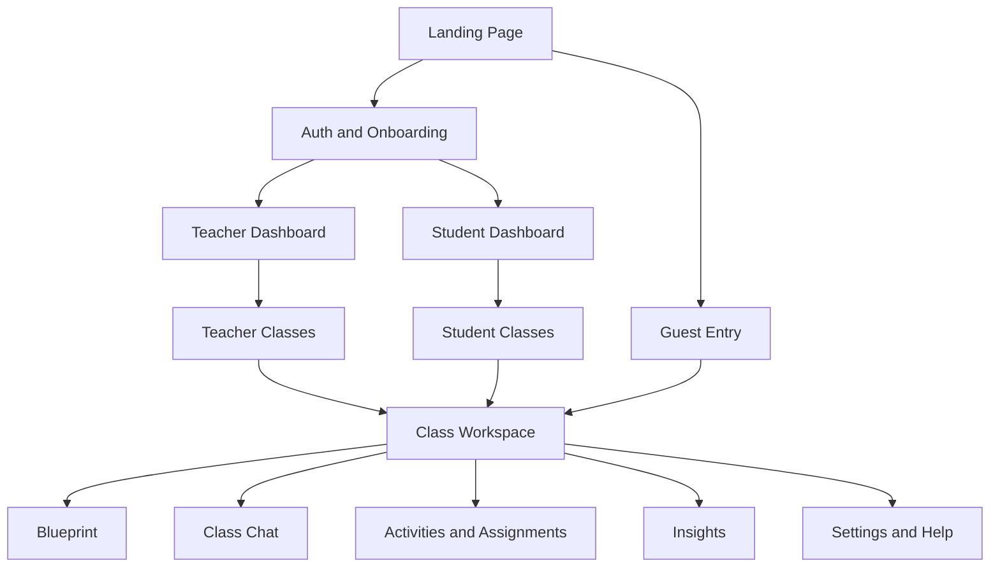
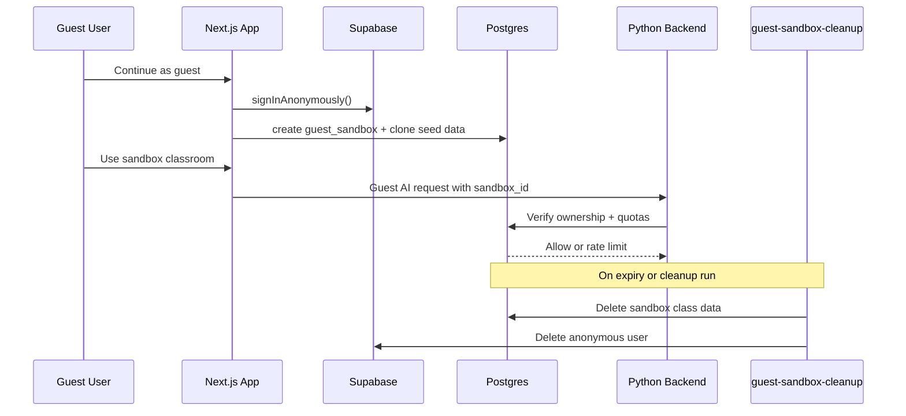
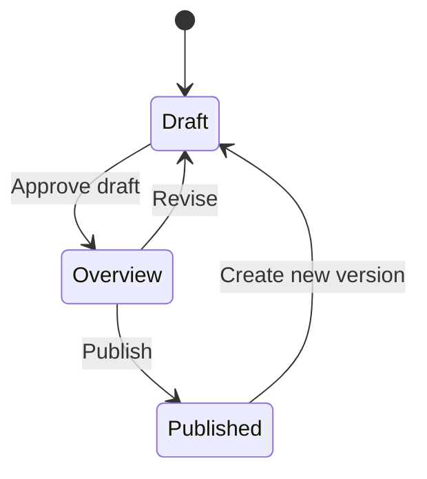
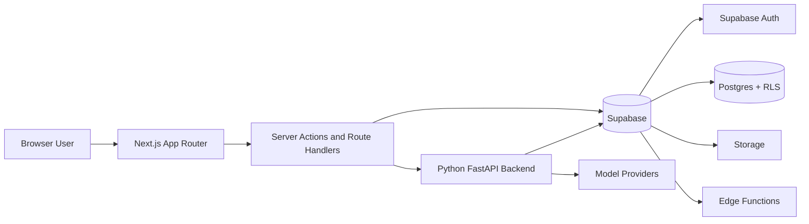
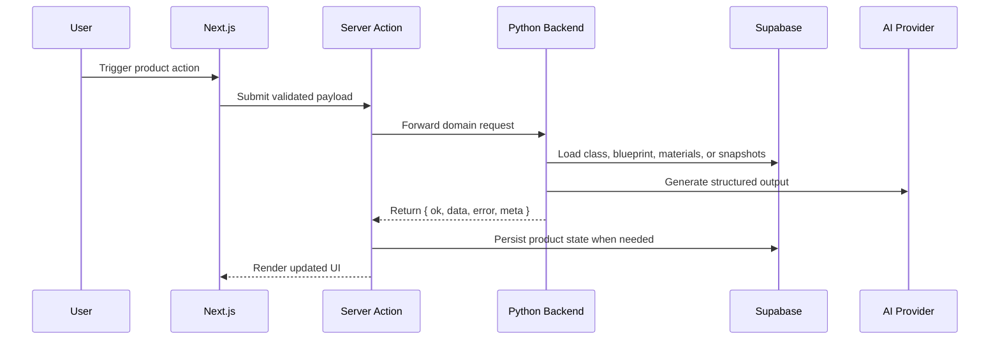

# DESIGN

This document describes the current product and technical design of the STEM Learning Platform with GenAI. It focuses on implemented behavior in the repository today and separates durable architecture from optional future-facing ideas.

## Product Goals

- Turn raw teaching materials into a structured Course Blueprint that becomes the source of truth for downstream learning experiences.
- Keep teachers in control of AI output through editable, auditable generation and publishing workflows.
- Give students a classroom workspace that feels focused, guided, and grounded in what their class is actually studying.
- Support grading, demonstration, and evaluation through guest-safe sandboxing, strong access control, and reviewable AI behavior.

## Non-Goals

- A general-purpose consumer chatbot unrelated to classroom context.
- A multi-role admin console. The current permanent role model is teacher or student.
- Direct provider calls from the web app. AI orchestration belongs to the Python backend.
- A read-only demo mode. Guest mode is intentionally interactive and sandboxed instead.

## Personas And Access Modes

### Teacher

- Creates and manages classes.
- Uploads materials and curates the Course Blueprint.
- Generates and assigns activities.
- Reviews submissions and class-level insights.

### Student

- Joins classes through join codes.
- Learns through chat, quizzes, flashcards, and published blueprint content.
- Tracks assignment state and receives teacher feedback.

### Guest

- Enters through Supabase Anonymous Auth.
- Receives a temporary cloned sandbox classroom.
- Can switch between teacher and student demo perspectives.
- Has quota and lifetime restrictions, and cannot carry sandbox work directly into a permanent account.

## Information Architecture And Navigation

The platform is intentionally split into distinct role-oriented experiences rather than one mixed dashboard.

### Navigation Principles

- Teacher and student dashboards are separate routes and separate mental models.
- Class routes stay within the same sidebar shell instead of switching to a different layout mid-flow.
- Teachers can preview the student class experience inside the same class workspace.
- Guests are constrained to their sandbox classroom and redirected away from routes outside that scope.

## Teacher Experience

### Core Workflow

1. Create a class.
2. Upload materials to the class library.
3. Wait for material processing to complete.
4. Generate the Course Blueprint.
5. Edit, approve, and publish the blueprint.
6. Generate activities from the published blueprint.
7. Assign activities to students.
8. Review submissions, chat behavior, and class intelligence.

### Teacher Surfaces

- Teacher dashboard and classes overview
- Class overview with assignment summaries and enrollment context
- Materials library with upload, preview, download, and delete actions
- Blueprint editor, overview, and published view
- Quiz and flashcard authoring flows
- Chat activity authoring
- Assignment review for chat, quiz, and flashcards
- Teacher chat monitor panel
- Adaptive teaching brief widget
- Class intelligence dashboard with charts, drill-downs, and intervention suggestions

## Student Experience

### Core Workflow

1. Sign in and join a class with a join code.
2. Enter the class workspace.
3. Review the published blueprint and current assignments.
4. Use always-on class chat or assigned learning activities.
5. Submit work and revisit reviewed feedback.

### Student Surfaces

- Student dashboard with current and past work
- Class workspace with widget-driven focus areas
- Published blueprint view
- Always-on chat workspace
- Quiz assignment panel
- Flashcards assignment panel
- Chat assignment panel
- Settings and help

The student class workspace can become chat-first when the route indicates chat focus or when a teacher previews the class as a student.

## Guest Sandbox Experience

Guest mode is a first-class product surface rather than a separate mock experience.

### Current Guest Design

- Entry begins from the landing page when guest mode is enabled.
- Supabase Anonymous Auth creates a real authenticated anonymous session.
- The platform creates a sandbox row and clones canonical demo content into normal product tables under a new `sandbox_id`.
- Guests can switch between teacher and student perspectives, reset the sandbox, or start real signup from a clean state.
- Expiry, cleanup, and AI quotas are enforced both in app flows and backend guardrails.

## Blueprint-Centered Learning Model

The Course Blueprint is the central pedagogical object in the system. It connects materials, objectives, activities, and class experiences.

### Blueprint Lifecycle

### Why The Blueprint Matters

- It structures topics and objectives from class materials.
- It grounds student chat and activity generation.
- It gives teachers an editorial checkpoint before students see AI-derived content.
- It provides a stable canonical snapshot for downstream features.

## Activity And Review Workflows

### Supported Activity Types

- `chat`
- `quiz`
- `flashcards`

These are the activity types that should be documented as implemented-first. Other study use cases can be described as chat-supported patterns, not separate product modules, unless the repository grows dedicated surfaces for them.

### Shared Workflow Pattern

1. Teacher publishes a blueprint.
2. Teacher generates an activity from that blueprint.
3. Teacher reviews and edits content where applicable.
4. Teacher assigns the activity.
5. Students complete the assignment.
6. Teacher reviews submissions and gives feedback.

## System Architecture

The system is a three-surface platform:

- `web/` for the Next.js application
- `backend/` for Python FastAPI AI and workflow orchestration
- `supabase/` for auth, data, storage, RLS, migrations, queues, and Edge Functions

### Request Flow

## AI Architecture

### Boundary

- Next.js owns UI, routing, server actions, and persistence orchestration.
- The Python backend owns AI generation, provider fallback, workflow logic, and service-level validation.
- Model providers are pluggable and environment-driven.

### Current AI Domains

- blueprint generation
- quiz generation
- flashcards generation
- grounded chat generation
- chat canvas generation
- class creation and join orchestration
- material dispatch orchestration
- class intelligence synthesis
- adaptive teaching brief synthesis
- natural-language data query to chart-spec generation

### Chat Architecture

- Chat is grounded in the published blueprint plus retrieved material chunks.
- Chat supports two execution paths:
  - `direct_v1`
  - `langgraph_v1`
- Workspace chat includes:
  - participant listing
  - session list/create/rename/archive
  - paginated message history
  - message send plus persistence
- Long conversations use compaction and context-window management instead of replaying the entire transcript every time.

### Visual Generation

- Chat can return a `canvas_hint` and trigger `/v1/chat/canvas` for diagrams and charts.
- Teacher data query uses analytics-backed chart spec generation to visualize class performance questions.

## Analytics And Teaching-Brief Architecture

Teacher analytics are not just UI charts. They are backed by snapshot storage and backend aggregation.

### Class Intelligence

- Aggregates quiz performance, Bloom-level coverage, student engagement, and intervention suggestions.
- Persists class snapshots to support caching and stable teacher reloads.
- Drives the class intelligence dashboard and AI-generated narrative.

### Adaptive Teaching Brief

- Generates a concise, teacher-oriented summary of what needs attention.
- Persists snapshot data separately from the full class intelligence payload.
- Surfaces recommended next steps and activity suggestions directly inside the class overview.

## Guest-Mode Architecture

Guest mode extends the same core system instead of creating a parallel demo stack.

### Key Decisions

- Real anonymous authenticated users
- Full sandbox cloning into regular product tables under `sandbox_id`
- Sandbox ownership checks in backend AI paths
- Rate limits for session creation and AI features
- Cleanup through request-time expiry and a dedicated Edge Function

### Resulting Benefits

- Guests see real product behavior
- RLS and middleware continue to work with minimal branching
- Demo data stays isolated from real classes

## Security And RLS Model

- Email/password auth is the standard permanent auth model.
- Email verification is required before protected access for permanent users.
- `profiles.account_type` is immutable for permanent accounts.
- Row Level Security is enforced across application data.
- Guest sandbox access is scoped by `sandbox_id` and verified ownership.
- Service-role and Edge Function boundaries are used for background jobs and cleanup.
- The Python backend validates user bearer tokens against Supabase and adds service-level guardrails for guest AI access, quotas, and sandbox ownership.

## UI System And Interaction Patterns

The UI is designed as a warm academic workspace rather than a generic admin dashboard.

### Current UI Foundation

- shared primitives in `web/src/components/ui`
- centralized icon registry in `web/src/components/icons/index.tsx`
- shared motion provider and presets in `web/src/components/providers/motion-provider.tsx` and `web/src/lib/motion/presets.ts`
- semantic CSS tokens and warm/editorial visual language in `web/src/app/globals.css`

### UX Patterns

- role-specific dashboards and class shells
- structured cards, badges, alerts, tables, and review surfaces
- class-shell continuity across subroutes
- motion used for hierarchy and orientation, not novelty
- teacher preview mode to validate student-facing flows without switching accounts

## Current Constraints

- The Python backend is required for the platform's AI-heavy and workflow-heavy surfaces.
- Guest mode depends on both app-side configuration and Supabase Anonymous Auth being enabled.
- Material processing depends on Supabase queueing plus the `material-worker` Edge Function.
- The project currently builds through Webpack rather than Turbopack.

## Forward-Looking Items

These are acceptable to mention only as future-facing items, not as shipped guarantees:

- broader activity types beyond chat, quiz, and flashcards
- richer operator tooling around deployment and observability
- additional provider-specific orchestration paths
- further analytics and intervention automation
