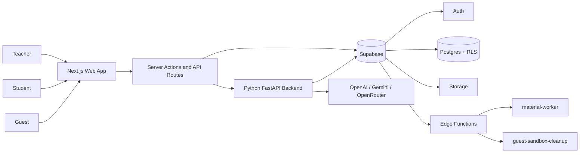
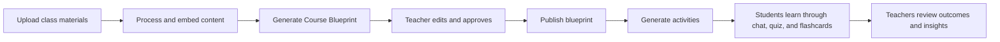

# STEM Learning Platform with GenAI

Production-ready STEM learning platform where teachers transform class materials into a structured Course Blueprint that powers grounded student learning experiences. The platform combines a role-specific web app, a Python AI orchestration backend, and Supabase-managed data, storage, and background jobs.

## What The Platform Does Today

- Teachers upload class materials, generate a Course Blueprint, curate it, and publish it as the class source of truth.
- Students learn inside a blueprint-grounded workspace with always-on chat, quizzes, flashcards, and assignment tracking.
- Teachers review submissions, monitor class chat activity, inspect class intelligence dashboards, and use adaptive teaching briefs to plan follow-up instruction.
- Guests can enter a sandbox classroom, switch between teacher and student views, and explore a safe demo flow without touching real user data.

## Core User Journeys

### Teacher

1. Create a class and share the join code.
2. Upload PDF, DOCX, or PPTX materials.
3. Wait for background extraction, chunking, and embedding to finish.
4. Generate and edit a Course Blueprint through its draft, overview, and published states.
5. Generate quiz, flashcard, or chat activities from the published blueprint.
6. Assign activities, review submissions, and inspect teaching insights.

### Student

1. Sign in and join a class with a join code.
2. Open the class workspace and review the published blueprint.
3. Use always-on class chat or complete assigned quizzes, flashcards, and chat activities.
4. Revisit the dashboard to track assigned, in-progress, submitted, and reviewed work.

### Guest

1. Enter from the landing page when guest mode is enabled.
2. Authenticate through Supabase Anonymous Auth.
3. Receive a cloned sandbox classroom seeded with demo materials, blueprint data, activities, analytics, and chat history.
4. Switch between teacher and student perspectives, reset the sandbox, or create a permanent account from a clean state.

## Feature Highlights

| Area | Current capability |
| --- | --- |
| Blueprint workflow | Draft -> Overview -> Published lifecycle with editable topics and objectives |
| Materials pipeline | Upload, process, preview, download, and delete classroom materials |
| Student learning | Always-on class chat, chat assignments, quizzes, flashcards |
| Teacher review | Submission review, feedback surfaces, transcript and attempt inspection |
| Teacher support | Adaptive teaching brief widget and class intelligence dashboard |
| Visual explanation | Generative canvas for diagrams, charts, and visual summaries |
| Guest access | Full sandbox demo mode with role switching and cleanup lifecycle |
| Testing | Web unit tests, backend unit tests, and Playwright E2E coverage |

## Architecture At A Glance



### Key Architectural Facts

- The web app is built with Next.js 16 App Router, TypeScript, Tailwind CSS 4, and a shared UI system built from Radix-style primitives, Lucide icons, and Motion.
- All AI generation and orchestration go through the Python FastAPI backend. The Next.js app no longer calls model providers directly.
- Supabase provides Auth, Postgres, Storage, Row Level Security, queue-backed material processing, guest sandbox persistence, and Edge Functions.
- The canonical backend response envelope is:

```json
{
  "ok": true,
  "data": {},
  "error": null,
  "meta": {
    "request_id": "..."
  }
}
```

## Teacher-To-Student Value Flow



## Repository Structure

| Path | Purpose |
| --- | --- |
| `web/` | Next.js application, routing, UI, server actions, and role-specific experiences |
| `backend/` | Python FastAPI backend for AI orchestration, class flows, analytics, and chat workspace services |
| `supabase/` | SQL migrations, Supabase local config, and Edge Functions |
| `tests/` | Playwright E2E tests and test artifacts |

## Local Development Setup

### Requirements

- Node.js 20+
- `pnpm`
- Python 3.11+
- A Supabase project or local Supabase stack
- At least one configured AI provider for end-to-end AI features

### Install Dependencies

From the repo root:

```bash
pnpm install
pip install -r backend/requirements.txt
```

### Configure Environment

1. Copy `web/.env.example` to `web/.env.local`.
2. If you run the Python backend separately, copy `backend/.env.example` to a local env file for that service.
3. Fill in:
   - `NEXT_PUBLIC_SUPABASE_URL`
   - `NEXT_PUBLIC_SUPABASE_PUBLISHABLE_KEY`
   - `SUPABASE_SECRET_KEY`
   - `NEXT_PUBLIC_SITE_URL`
   - `PYTHON_BACKEND_URL`
   - `PYTHON_BACKEND_API_KEY` unless local unauthenticated access is explicitly enabled
   - at least one AI provider key and model pair
4. Enable guest mode only when your Supabase project also has Anonymous Auth enabled:
   - `NEXT_PUBLIC_GUEST_MODE_ENABLED=true`

### Run The App

Terminal 1:

```bash
pnpm dev
```

Terminal 2:

```bash
uvicorn app.main:app --app-dir backend --host 0.0.0.0 --port 8001 --reload
```

## Testing And Verification

### Web Tests

```bash
pnpm test
pnpm test:watch
pnpm vitest run "web/src/app/classes/[classId]/_components/MaterialActionsMenu.test.tsx"
```

### Backend Tests

```bash
python3 -m unittest discover -s backend/tests -p 'test_*.py'
```

### E2E Tests

1. Copy `tests/.env.example` to `tests/.env`.
2. Fill in hosted or preview credentials and join code.
3. Run:

```bash
npx playwright test --config tests/playwright.config.ts
```

E2E coverage currently includes teacher navigation, student navigation, class access flows, settings, sign-out, and guest entry.

## Deployment Overview

- `web/` is deployed as the Next.js frontend.
- `backend/` is deployed as a separate FastAPI service.
- `supabase/` migrations and Edge Functions must be applied to the target Supabase project.
- Material processing runs through Supabase queueing and the `material-worker` Edge Function.
- Guest sandbox cleanup runs through the `guest-sandbox-cleanup` Edge Function.

See [DESIGN.md](DESIGN.md) for the product and technical design, and [DEPLOYMENT.md](DEPLOYMENT.md) for the hosted rollout runbook.

## Known Constraints

- The Python backend is required for all AI generation, class create/join, class chat workspace operations, material dispatch, analytics, and visual generation.
- Guest mode depends on both `NEXT_PUBLIC_GUEST_MODE_ENABLED` and Supabase Anonymous Auth being enabled for the target project.
- Material processing depends on the Supabase queue worker path, not a purely synchronous Vercel request flow.
- The web app uses `--webpack` for `pnpm dev` and `pnpm build`; Turbopack is not the current project path.

## Related Docs

- [ARCHITECTURE.md](ARCHITECTURE.md) — deep technical architecture and runtime flows
- [DESIGN.md](DESIGN.md) — product and technical design
- [DEPLOYMENT.md](DEPLOYMENT.md) — deployment and operations guide
- [UIUX.md](UIUX.md) — UI/UX language, system, and frontend implementation
- [web/README.md](web/README.md) — web app-specific notes
- [backend/README.md](backend/README.md) — Python backend guide
- [supabase/README.md](supabase/README.md) — Supabase migration notes
