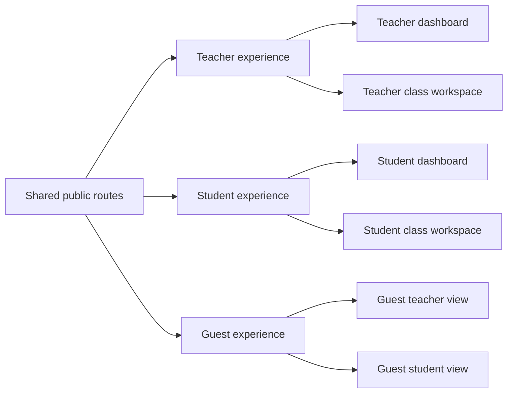
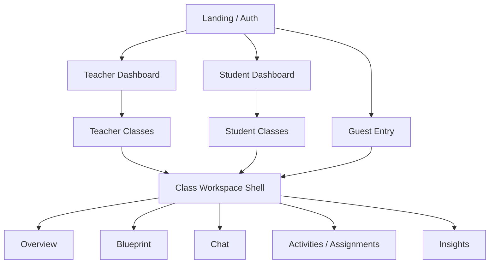
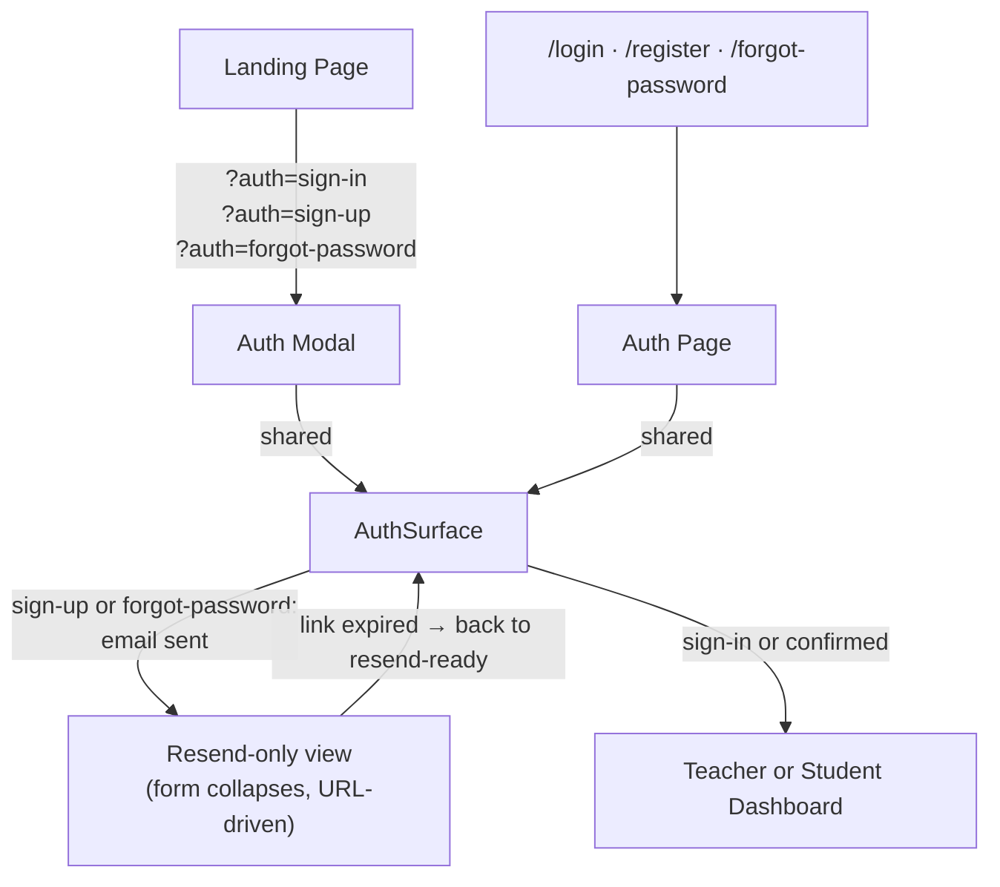
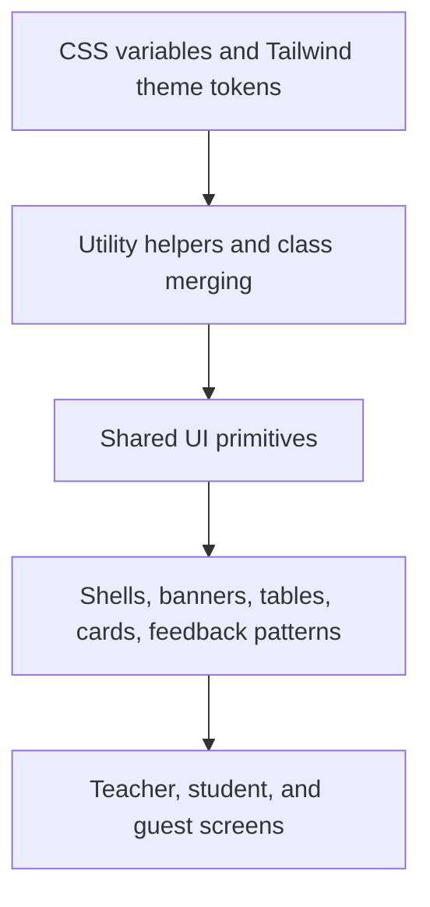
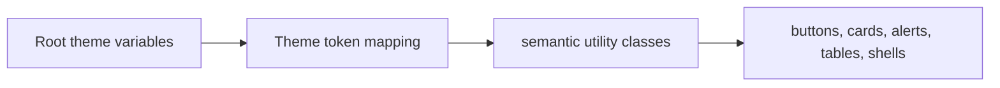
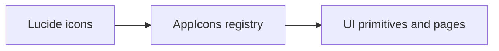
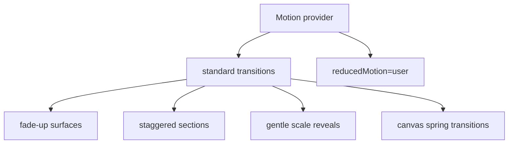
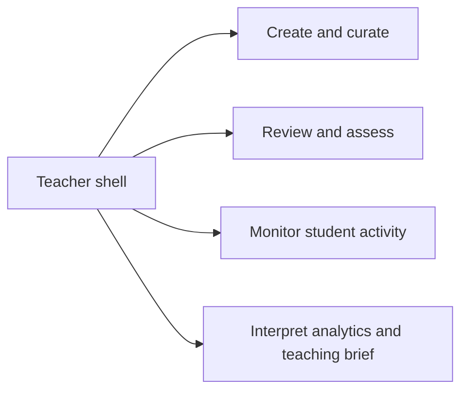
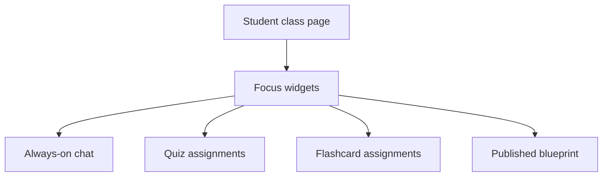
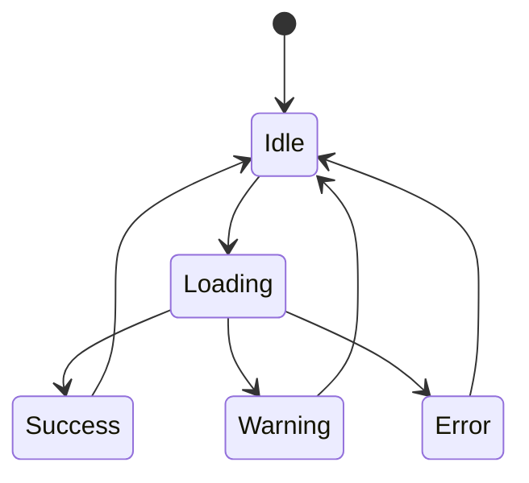

# UIUX

This document is the interface and frontend implementation deep dive for the STEM Learning Platform with GenAI. It complements `DESIGN.md`: `DESIGN.md` explains the broad product experience and system context, while this document focuses on UI language, navigation patterns, frontend implementation choices, and how the design system is expressed in code.

## 1. Purpose

Use this document when you want to understand:

- the platform's visual and interaction language
- how teacher, student, and guest experiences differ in the UI
- how the React, Tailwind, shadcn/ui-style, icon, and motion layers fit together
- how shared primitives become route-level product surfaces
- what consistency guardrails currently shape frontend work

## 2. UX Philosophy

The project aims to feel like an academic workspace rather than a generic dashboard or consumer chatbot. The UI is designed to communicate structure, trust, and guided learning.

### Current design goals

- make teacher and student experiences feel intentionally different
- keep generated AI features embedded in classroom workflows rather than floating as separate tools
- use warm, editorial styling to make the platform feel grounded and serious
- reduce visual fragmentation by centralizing tokens, primitives, and motion defaults
- keep guest mode honest and contextual instead of making it feel like a fake product tour

## 3. Role-Based Experience Model

The product is UI-distinct by role.

### Why this matters

- Teachers need creation, review, insight, and monitoring surfaces.
- Students need guided learning and progress surfaces.
- Guests need a safe but realistic evaluation flow.

This design would be harder to understand if everything were forced into a single shared dashboard model.

## 4. Information Architecture And Navigation

Navigation is persistent, role-aware, and shell-based.

### Current navigation principles

- teacher and student dashboards are distinct destinations
- class subroutes stay inside the same shell
- sidebar active states are route-driven
- preview-as-student stays within the class shell rather than switching accounts
- guests are kept inside sandbox-compatible destinations

### Auth surface navigation model

Public auth uses a **home-first hybrid** pattern. The primary unauthenticated entry point opens sign-in, sign-up, and forgot-password inside a modal launched directly from `/` via `?auth=…` query params. Dedicated page routes (`/login`, `/register`, `/forgot-password`) remain as compact fallbacks for deep links, validation round-trips, and non-JS access.

Both presentations share a single `AuthSurface` component — auth markup is never duplicated across pages. Modal state is URL-driven and server-rendered, so the confirmation and resend flows survive full page reloads without any client-side state management.

After a sign-up email is sent, the form collapses into a resend-only surface. The two states (registration form vs. resend button) are mutually exclusive and driven by URL search params — this keeps confirmation recovery available in-place without a separate route. Invalid or expired confirmation links redirect back to the resend-ready sign-up state; invalid recovery links redirect to the resend-ready forgot-password state.

## 5. Frontend Layering

The frontend stack is layered intentionally rather than being a flat collection of pages and classes.

### Current implementation stack

| Layer | Implementation |
| --- | --- |
| App framework | Next.js 16 App Router |
| View layer | React |
| Styling | Tailwind CSS 4 plus CSS variables |
| Primitive layer | shadcn/ui-style components in `web/src/components/ui/` |
| Composition helper | `cn()` from `web/src/lib/utils.ts` |
| Variants | `class-variance-authority` |
| Icons | Lucide via `web/src/components/icons/index.tsx` |
| Motion | Motion for React via `motion/react` |

## 6. Visual Language

The current UI language is warm, editorial, and classroom-oriented.

### Main traits

- soft paper-like background and muted surfaces
- warm accent family built around `--accent-primary`
- serif editorial emphasis for hero and major headings
- calm status colors for success, warning, and error states
- rounded cards and shells that feel product-grade rather than experimental

### Token system

The token source of truth is `web/src/app/globals.css`.

### Key token families already in use

- surface and text tokens:
  - `--surface-card`
  - `--surface-muted`
  - `--text-muted`
  - `--text-subtle`
- accent tokens:
  - `--accent-primary`
  - `--accent-primary-strong`
  - `--accent-soft`
- status tokens:
  - success
  - warning
  - error
- motion tokens:
  - `--motion-fast`
  - `--motion-standard`
  - `--motion-slow`

## 7. Typography, Color, And Spacing

### Typography

- `font-sans`, `font-heading`, and `font-mono` are set through theme mapping
- `.editorial-title` provides a stronger serif voice for large narrative surfaces
- headings are intentionally more expressive than body text

### Color

- accent color is warm, not neon
- background is light and slightly paper-toned
- state colors are semantic and centralized, not ad hoc utility values

### Spacing

- shells and cards rely on generous padding and grouped sections
- the product prefers readable breathing room over dense data-grid packing

## 8. Shared Component System

The primitive component layer is centralized in `web/src/components/ui/`.

### Current primitives

- `button`
- `card`
- `badge`
- `alert`
- `dialog`
- `dropdown-menu`
- `input`
- `textarea`
- `progress`
- `table`
- `tabs`
- `tooltip`
- `accordion`
- `sheet`
- `skeleton`

### Why this matters

- interaction behavior is more consistent
- page-level styling duplication is reduced
- design decisions become easier to propagate across the product

### Example: button architecture

`web/src/components/ui/button.tsx` shows the current pattern:

- one primitive component
- CVA-driven variants
- size variants
- semantic visual intent
- optional `Slot` support for `asChild`

This is a good example of keeping behavior and styling reusable instead of rebuilding buttons route by route.

## 9. Icon System

Icons are centralized through `web/src/components/icons/index.tsx`.

### Benefits of the registry approach

- icon usage becomes semantically named
- pages avoid inline SVG drift
- swapping icon choices stays localized
- the project maintains a more coherent visual vocabulary

## 10. Motion System

The project uses Motion for React, imported from `motion/react`. This is the modern package path for Framer Motion's React motion APIs.

### Core motion pieces

- global provider: `web/src/components/providers/motion-provider.tsx`
- presets: `web/src/lib/motion/presets.ts`

### Current animation model

### Practical uses

- dashboard and page entrance animation
- staggered section reveal
- hover and lift feedback
- generative canvas reveal transitions
- sidebar width transitions

### Why this approach works

- motion is centralized instead of improvised
- reduced-motion preferences are respected
- the UI feels polished without becoming overly animated

## 11. Teacher Experience Patterns

Teacher surfaces optimize for control, review, and interpretation.

### Common teacher UI patterns

- summary cards and quick metrics
- materials library with action menus
- rich editors and review screens
- intelligence dashboards with charts and tables
- contextual banners for warnings or review states
- preview-as-student for experience validation

### Teacher information priorities

This differs from the student experience, which is optimized more around action-taking than oversight.

## 12. Student Experience Patterns

Student surfaces optimize for clarity, action, and guided progress.

### Common student UI patterns

- assignment status pills
- focused workspace cards
- chat-first classroom mode when appropriate
- simplified action framing
- less administrative density than teacher screens

### Student workspace model

## 13. Guest UX Patterns

Guest mode is not just a hidden feature flag. It has its own UX language and states.

### Current guest patterns

- guest CTA from landing page
- inline feedback when guest entry fails
- guest banner inside the class shell
- role switching within the sandbox
- reset and create-account options
- explicit temporary-session framing

### Why this is good UX

- evaluators know they are in a safe demo environment
- the product remains honest about persistence and limits
- guests still see real product flows instead of a fake landing tour

## 14. Interaction States And Feedback Design

The platform consistently uses structured feedback instead of silent state changes.

### Current state types

- loading states and skeletons
- success, warning, and error alerts
- transient feedback for actions
- disabled states for guarded interactions
- route-level redirects with contextual messaging

### Example implementation patterns

- transient feedback alerts
- preview loading and error states for materials
- guest landing feedback mapping
- assignment status rendering

## 15. Frontend Conventions In Code

### Utility merging

`web/src/lib/utils.ts` uses `clsx` plus `tailwind-merge` via `cn()`.

This means:

- conditional classes stay readable
- Tailwind conflicts are resolved centrally
- composed primitives stay cleaner at call sites

### Variant approach

Components such as the button use `class-variance-authority` to encode style intent as variants instead of scattering utility decisions across pages.

### Shell-first composition

`Sidebar.tsx` and `RoleAppShell.tsx` show the current preference for shared shells over route-by-route navigation construction.

## 16. Accessibility And Consistency Guardrails

The current design system direction helps with consistency and accessibility, even if a dedicated accessibility audit would still be valuable later.

### Current strengths

- reusable primitives instead of bespoke controls
- semantic status colors
- keyboard shortcut handling in sidebar behavior
- tooltip and dialog primitives
- reduced-motion support through the motion provider

### Current guardrail philosophy

- centralize instead of improvise
- favor semantic tokens over hardcoded colors
- keep icon usage in the registry
- keep motion presets reusable and restrained

## 17. Current Constraints And Future Polish

### Current constraints

- the UI depends on the backend being reachable for many meaningful surfaces
- material processing is async, so some UX must remain status-driven
- guest mode requires both product config and infrastructure support
- some deep visual documentation is still implicit in code rather than fully captured in prose

### Future polish directions

- more formal accessibility review documentation
- fuller pattern catalog of route-level composed surfaces
- richer examples of chart and insight presentation patterns
- additional UI documentation around mobile and responsive behavior

## 18. Related Docs

- [README.md](README.md) for project overview
- [DESIGN.md](DESIGN.md) for broad product and system design
- [ARCHITECTURE.md](ARCHITECTURE.md) for runtime and subsystem architecture
- [DEPLOYMENT.md](DEPLOYMENT.md) for operations and rollout
- [web/README.md](web/README.md) for frontend package-specific notes
