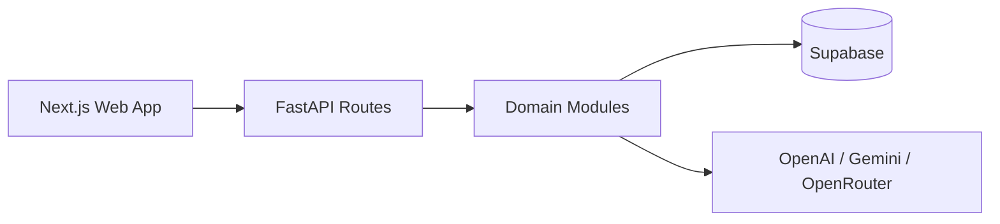

# STEM Python Backend

This package contains the FastAPI backend that acts as the sole AI orchestration and service workflow layer for the STEM Learning Platform. The web app depends on this service for AI generation, chat workspace behavior, analytics, teaching briefs, and several class-level workflows.

## Responsibilities

The backend owns:

- provider orchestration across OpenAI, Gemini, and OpenRouter
- structured AI generation for blueprints, quizzes, flashcards, chat, analytics, and teaching briefs
- chat workspace session and message orchestration
- guest sandbox AI guardrails and quota enforcement
- class create and join flows
- material dispatch orchestration
- response envelope normalization

## Service Architecture



### Key Modules

| Module | Purpose |
| --- | --- |
| `app/main.py` | app bootstrap, auth middleware, route registration, exception handling |
| `app/providers.py` | provider fallback and embeddings generation |
| `app/chat.py` | grounded chat generation |
| `app/chat_workspace.py` | session lifecycle, pagination, compaction, persistence orchestration |
| `app/blueprints.py` | blueprint generation |
| `app/quiz.py` | quiz generation |
| `app/flashcards.py` | flashcard generation |
| `app/materials.py` | material dispatch and processing triggers |
| `app/analytics.py` | class intelligence, teaching brief, data query generation |
| `app/canvas.py` | chart and visual canvas spec validation/generation helpers |
| `app/classes.py` | class creation and join-by-code |
| `app/config.py` | environment-driven settings |
| `app/schemas.py` | request and response schemas |

## Response Contract

All normal domain routes return the canonical envelope:

```json
{
  "ok": true,
  "data": {},
  "error": null,
  "meta": {
    "request_id": "..."
  }
}
```

This contract is relied on by the frontend adapters and should remain stable.

## Routes

### Health And Generic LLM

- `GET /healthz`
- `POST /v1/llm/generate`
- `POST /v1/llm/embeddings`

### Materials

- `POST /v1/materials/dispatch`
- `POST /v1/materials/process`

### Class Workflows

- `POST /v1/classes/create`
- `POST /v1/classes/join`

### Learning Content Generation

- `POST /v1/blueprints/generate`
- `POST /v1/quiz/generate`
- `POST /v1/flashcards/generate`

### Chat

- `POST /v1/chat/generate`
- `POST /v1/chat/canvas`
- `POST /v1/chat/workspace/participants`
- `POST /v1/chat/workspace/sessions/list`
- `POST /v1/chat/workspace/sessions/create`
- `POST /v1/chat/workspace/sessions/rename`
- `POST /v1/chat/workspace/sessions/archive`
- `POST /v1/chat/workspace/messages/list`
- `POST /v1/chat/workspace/messages/send`

### Analytics

- `POST /v1/analytics/class-insights`
- `POST /v1/analytics/class-teaching-brief`
- `POST /v1/analytics/data-query`

## Auth Model

### Service Authentication

- The web app authenticates to the backend with `PYTHON_BACKEND_API_KEY`.
- In hosted environments, `PYTHON_BACKEND_ALLOW_UNAUTHENTICATED_REQUESTS` should remain `false`.

### User Authentication

- Some routes also require a valid Supabase user bearer token.
- The backend verifies that bearer token against Supabase Auth.
- Class create/join and guest-aware AI flows rely on authenticated user identity, not just the service key.

## Guest Mode Guardrails

Guest AI requests are not just a frontend concern. The backend enforces:

- sandbox ownership verification
- per-feature guest rate limits
- guest concurrent AI slot limits
- guest-specific `sandbox_id` requirements where applicable

Current guest guardrail env vars:

- `GUEST_MAX_CONCURRENT_AI_REQUESTS`
- `GUEST_CHAT_LIMIT`
- `GUEST_QUIZ_LIMIT`
- `GUEST_FLASHCARDS_LIMIT`
- `GUEST_BLUEPRINT_LIMIT`
- `GUEST_EMBEDDING_LIMIT`

## Chat Execution Modes

The backend supports:

- `direct_v1`
- `langgraph_v1`

### Current Chat Behavior

- chat is grounded in published blueprint data and retrieved material chunks
- workspace chat persists sessions and paginated message history
- long conversations use compaction rather than replaying the full transcript
- `langgraph_v1` can use tool-aware orchestration while preserving the frontend contract

## Analytics And Visual Generation

The backend also powers teacher-facing intelligence flows.

### Class Intelligence

- aggregates class quiz, engagement, and topic data
- produces structured class insight payloads
- persists snapshot-friendly results through Supabase-backed workflows

### Teaching Brief

- generates concise teacher-oriented summaries and actions
- normalizes mixed-shape AI payloads into stable frontend-safe data

### Data Query And Canvas

- converts natural language analytics questions into structured chart specifications
- supports chat-side canvas generation through `/v1/chat/canvas`

## Local Run

### Requirements

- Python 3.11+
- project dependencies from `backend/requirements.txt`

### Install

```bash
pip install -r backend/requirements.txt
```

### Start The Service

```bash
uvicorn app.main:app --app-dir backend --host 0.0.0.0 --port 8001 --reload
```

## Important Environment Variables

### Backend Service

- `PYTHON_BACKEND_API_KEY`
- `PYTHON_BACKEND_ALLOW_UNAUTHENTICATED_REQUESTS`
- `PYTHON_BACKEND_LOG_PROVIDER_FAILURES`

### Provider Routing

- `AI_PROVIDER_DEFAULT`
- `AI_REQUEST_TIMEOUT_MS`
- `AI_EMBEDDING_TIMEOUT_MS`

### OpenRouter

- `OPENROUTER_API_KEY`
- `OPENROUTER_MODEL`
- `OPENROUTER_EMBEDDING_MODEL`
- `OPENROUTER_BASE_URL`
- `OPENROUTER_SITE_URL`
- `OPENROUTER_APP_NAME`

### OpenAI

- `OPENAI_API_KEY`
- `OPENAI_MODEL`
- `OPENAI_EMBEDDING_MODEL`

### Gemini

- `GEMINI_API_KEY`
- `GEMINI_MODEL`
- `GEMINI_EMBEDDING_MODEL`

### Supabase Integration

- `SUPABASE_URL`
- `SUPABASE_SERVICE_ROLE_KEY`

Optional compatibility fallbacks:

- `NEXT_PUBLIC_SUPABASE_URL`
- `NEXT_PUBLIC_SUPABASE_PUBLISHABLE_KEY`
- `NEXT_PUBLIC_SUPABASE_ANON_KEY`
- `SUPABASE_SECRET_KEY`

### Material Worker Integration

- `MATERIAL_WORKER_TOKEN`
- `MATERIAL_WORKER_BATCH`
- `MATERIAL_WORKER_FUNCTION_URL`

## Operational Notes

- All `httpx` calls should continue using `trust_env=False` to avoid proxy-related production failures.
- The backend is designed to fail closed if service auth is misconfigured.
- Invalid user bearer tokens should resolve to JSON envelope errors, not HTML error pages.
- The backend is a required runtime dependency, not an optional optimization layer.

## Tests

Run all backend unit tests:

```bash
python3 -m unittest discover -s backend/tests -p 'test_*.py'
```

### Current Test Coverage Areas

- startup and exception handling
- provider fallback and config
- blueprint, quiz, flashcards, chat, materials, and class domains
- workspace pagination and compaction
- analytics and guest-rate-limit behavior

## Related Docs

- [`../README.md`](../README.md) — project overview
- [`../ARCHITECTURE.md`](../ARCHITECTURE.md) — deep technical architecture
- [`../DESIGN.md`](../DESIGN.md) — product and technical design
- [`../DEPLOYMENT.md`](../DEPLOYMENT.md) — deployment runbook
- [`../UIUX.md`](../UIUX.md) — frontend system and UI language
- [`../web/README.md`](../web/README.md) — frontend behavior and envs
- [`../supabase/README.md`](../supabase/README.md) — schema, functions, and queueing
