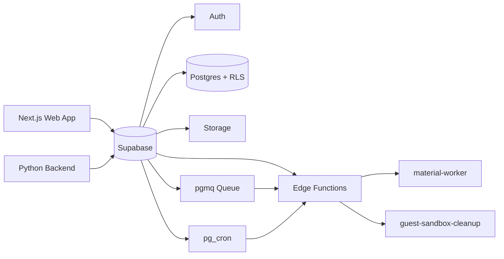
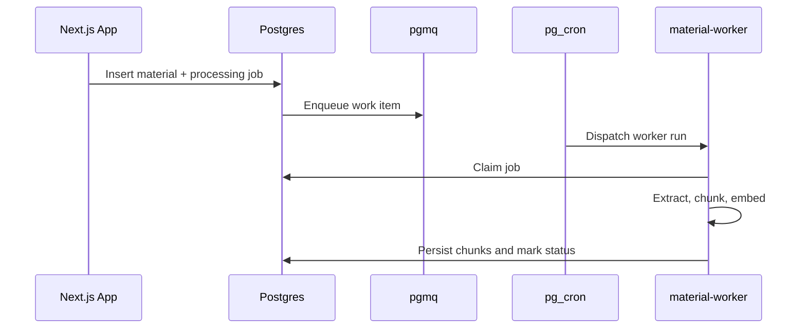

# Supabase Setup

This directory contains the schema migrations, local Supabase configuration, and Edge Functions that support the STEM Learning Platform. Supabase is not just the database layer for this project. It also provides auth, storage, queue-backed background processing, guest sandbox lifecycle data, and Edge Function runtime support.

## Email Template Workflow

- the confirmation email source of truth lives at `supabase/templates/confirmation.html`
- local Supabase uses that template through `auth.email.template.confirmation` in `supabase/config.toml`
- hosted Supabase still needs the same HTML pasted into Auth → Email Templates → Confirm signup
- the confirmation button is intentionally wired to the app SSR route:
  `{{ .RedirectTo }}/auth/confirm?token_hash={{ .TokenHash }}&type=email&next=/login`
- the template depends on publicly served brand assets under `web/public/email/`
- after changing the local template config, restart local Supabase so the auth service reloads it
- confirmation and recovery email links are expected to expire after 5 minutes; keep local `auth.email.otp_expiry` and the hosted project's Email OTP Expiration dashboard setting aligned at `300`

## What Lives Here

| Path | Purpose |
| --- | --- |
| `migrations/` | active SQL migrations applied by `supabase db push` |
| `migrations_archive/` | historical archived migration files not used by the active CLI path |
| `functions/material-worker/` | material processing worker |
| `functions/guest-sandbox-cleanup/` | guest sandbox cleanup worker |
| `templates/confirmation.html` | branded confirmation email template — paste into Supabase Dashboard → Auth → Email Templates |
| `config.toml` | local Supabase configuration |

## Supabase Responsibilities In This Project

- email/password auth
- anonymous auth for guest mode
- Postgres schema and RLS
- private materials storage
- queue-backed material processing with `pgmq`
- cron-backed dispatch and SQL helper functions
- snapshot storage for class intelligence and teaching briefs
- guest sandbox persistence and cleanup support

## Schema Evolution Highlights

The migration history reflects several major architectural shifts.

### Foundation

- `0001_init.sql`
  - baseline schema
  - core tables
  - RLS
  - material processing jobs
  - assignment recipient model
  - AI request logging

### Early Hardening And Blueprint Model

- `0002_quiz_integrity_and_review_performance.sql`
- `0003_auth_account_hardening.sql`
- `0004_blueprint_canonical_snapshot.sql`

### Chat And Material Pipeline

- `0005_always_on_class_chat.sql`
- `0006_class_chat_assistant_insert_hardening.sql`
- `0007_class_chat_context_compaction.sql`
- `0008_material_queue_worker.sql`
- `0009_remove_vision_legacy_artifacts.sql`

### Performance And Teacher Intelligence

- `0010_frontend_route_performance_indexes.sql`
- `0011_fix_publish_blueprint_advisory_lock.sql`
- `0012_materials_delete_policy.sql`
- `0013_add_class_insights_snapshots.sql`
- `0014_add_class_teaching_brief_snapshots.sql`

### Guest Mode

- `0015_guest_mode_schema.sql`
- `0016_guest_seed_data.sql`
- `0017_guest_mode_enforcement.sql`
- `0018_guest_entry_rate_limit.sql`
- `0019_guest_mode_alignment_fixes.sql`
- `0020_fix_guest_clone_profile_bootstrap.sql`
- `0021_fix_guest_seed_insight_scores.sql`

## Data And Background Job Topology



## Local Development

### Link And Push

```bash
npx supabase link --project-ref <PROJECT_REF>
npx supabase db push
```

### Notes

- active migrations are read from `supabase/migrations/*.sql`
- archived migration files are not part of the active CLI migration path
- local `config.toml` already encodes important behavior like email confirmations and anonymous sign-ins

## Required Hosted Project Capabilities

The hosted project should support the capabilities used by the migrations:

- `pgcrypto`
- `vector`
- `pgmq`
- `pg_net`
- `pg_cron`
- `vault`

## Auth Notes

### Permanent Users

- email/password auth only
- email confirmation enabled
- immutable account type in `profiles`
- verification emails use a custom branded confirmation template and should resolve through the app's `/auth/confirm` route for SSR-safe verification

### Guest Users

- guest mode depends on Supabase Anonymous Auth
- anonymous users still get real auth identities
- guest sandboxes store ownership and lifecycle state in `guest_sandboxes`
- cleanup removes guest class data and anonymous auth users

## Storage Notes

- materials are stored in the private `materials` bucket
- the baseline schema creates the bucket if it does not exist
- `material_chunks.embedding` currently uses `vector(1536)`
- if embedding dimension changes, keep migration logic and runtime `EMBEDDING_DIM` aligned

## Material Processing

Material processing is asynchronous and queue-backed.



### Important Operational Facts

- material work is not driven by Vercel cron
- dispatch relies on SQL-side queue and cron helpers
- `material-worker` needs its own secrets in Supabase
- provider embedding models must be configured for the worker to complete successfully

## Guest Sandbox Cleanup

`guest-sandbox-cleanup` is responsible for cleaning expired or discarded guest sandboxes.

### Cleanup Responsibilities

- find expired or discarded guest sandboxes
- remove guest material storage paths
- delete sandbox-scoped class data
- delete anonymous auth users
- remove `guest_sandboxes` rows

## Secrets And Vault Notes

### Edge Function Secrets

Set these in Supabase for the functions that need them:

- `MATERIAL_WORKER_TOKEN`
- `GUEST_SANDBOX_CLEANUP_TOKEN`
- provider API keys and model env vars for worker execution

### Vault Secrets

Material dispatch expects Vault secrets such as:

- `project_url`
- `material_worker_token`

These are used by SQL-side dispatch helpers and should be configured in each hosted environment.

## RLS And Access Model

- RLS is enabled across application tables
- policies enforce teacher ownership, enrollment-based access, and guest sandbox isolation
- guest-mode migrations extend many tables with `sandbox_id` so cloned demo data can live alongside real product data safely

## Edge Functions

### Deploy

```bash
npx supabase functions deploy material-worker
npx supabase functions deploy guest-sandbox-cleanup
```

### Current Function Roles

- `material-worker`
  - process queued materials
  - extract text
  - chunk text
  - generate embeddings
  - update processing state
- `guest-sandbox-cleanup`
  - reclaim expired guest data
  - remove storage artifacts
  - delete anonymous users

## When To Read This Folder

Use this directory as the primary source of truth when you need to understand:

- schema changes
- guest-mode persistence
- background job behavior
- storage rules
- SQL-side operational assumptions

## Related Docs

- [`../README.md`](../README.md) — project overview
- [`../ARCHITECTURE.md`](../ARCHITECTURE.md) — deep technical architecture
- [`../DESIGN.md`](../DESIGN.md) — product and system design
- [`../DEPLOYMENT.md`](../DEPLOYMENT.md) — hosted deployment runbook
- [`../UIUX.md`](../UIUX.md) — frontend language and interface system
- [`../backend/README.md`](../backend/README.md) — backend service behavior
- [`../web/README.md`](../web/README.md) — frontend behavior and envs
