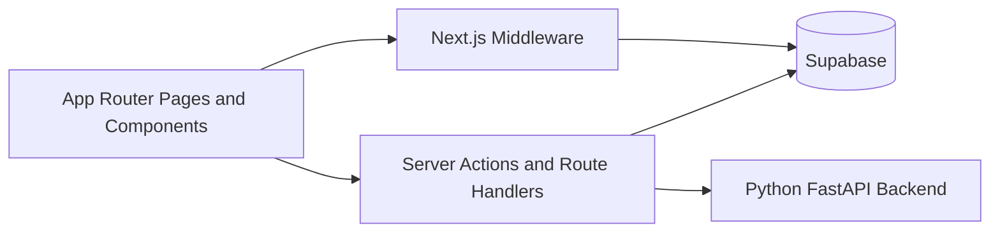

# STEM Learning Platform Web App

This package contains the Next.js 16 App Router frontend for the STEM Learning Platform. It owns the role-based user experience, server actions, route handlers, and product-facing orchestration around Supabase and the Python backend.

## Scope

The web app is responsible for:

- landing, auth, onboarding, settings, and help flows
- teacher and student dashboards
- class workspaces and sidebar-shell navigation
- material upload and file actions
- Blueprint authoring and publishing flows
- activity creation, assignment execution, and review surfaces
- teacher insights, adaptive teaching brief, and chat monitoring UIs
- guest entry and sandbox-aware routing

The web app is not the AI orchestration layer. All AI generation and most workflow-heavy service logic are delegated to the Python backend.

## Frontend Architecture



### Key Boundaries

- React components render the product surfaces and gather user input.
- server actions enforce product rules, read and write Supabase data, and call backend service adapters.
- middleware protects authenticated routes, verifies email-confirmed users, and enforces guest sandbox routing.
- Python backend adapters in `web/src/lib/ai/python-*.ts` and `web/src/lib/chat/python-workspace.ts` are the only supported path for AI-facing flows.

## Major Product Surfaces

### Shared

- landing page with role-focused CTA flow
- auth routes:
  - login
  - register
  - forgot password
  - reset password
  - confirm callback
- settings and help

### Teacher

- teacher dashboard and classes list
- class overview
- materials library
- Blueprint editor, overview, and published pages
- chat activity creation
- quiz creation and editing
- flashcards creation and editing
- assignment review
- class intelligence dashboard
- adaptive teaching brief
- preview-as-student mode

### Student

- student dashboard and classes list
- join class flow
- class workspace
- published blueprint view
- always-on class chat
- quiz assignments
- flashcard assignments
- chat assignments

### Guest

- guest entry route
- guest-aware landing error messaging
- guest sandbox routing and class-shell behavior
- guest role-switch and reset actions

## Directory Guide

| Path | Purpose |
| --- | --- |
| `src/app/` | App Router pages, layouts, route handlers, server actions |
| `src/components/ui/` | shared UI primitives |
| `src/components/icons/` | centralized icon registry |
| `src/components/providers/` | global providers including motion |
| `src/lib/ai/` | frontend-to-backend adapters for AI domains |
| `src/lib/chat/` | chat generation and workspace adapters |
| `src/lib/actions/` | higher-level server-action helpers such as insights and teaching brief |
| `src/lib/guest/` | guest mode configuration, sandbox flows, and helper logic |
| `src/lib/materials/` | extraction, chunking, retrieval, and related helpers used by frontend tests and orchestration |

## UI System

The current frontend uses a shared design system rather than page-local styling.

### Current Conventions

- shared primitives live in `src/components/ui`
- icons are consumed from `src/components/icons/index.tsx`
- semantic styling comes from CSS variables in `src/app/globals.css`
- motion is centralized through:
  - `src/components/providers/motion-provider.tsx`
  - `src/lib/motion/presets.ts`

### Visual Direction

- warm academic palette
- editorial serif display emphasis
- role-specific dashboards and classroom shells
- structured cards, badges, alerts, and review surfaces
- restrained motion used for hierarchy and feedback

## Runtime Requirements

### Node And Tooling

- Node.js 20+
- `pnpm`

### Required Upstream Services

- Supabase project with the current migration set applied
- Python backend running and reachable via `PYTHON_BACKEND_URL`
- at least one configured AI provider

## Setup

From the repo root:

```bash
pnpm install
```

Copy the env example:

```bash
cp web/.env.example web/.env.local
```

## Important Environment Variables

### Supabase

- `NEXT_PUBLIC_SUPABASE_URL`
- `NEXT_PUBLIC_SUPABASE_PUBLISHABLE_KEY`
- `SUPABASE_SECRET_KEY`
- `NEXT_PUBLIC_SITE_URL`

### Python Backend

- `PYTHON_BACKEND_URL`
- `PYTHON_BACKEND_API_KEY`
- `PYTHON_BACKEND_CHAT_ENGINE`
- `PYTHON_BACKEND_CHAT_TOOL_MODE`
- `PYTHON_BACKEND_CHAT_TOOL_CATALOG`
- `PYTHON_BACKEND_MATERIAL_TIMEOUT_MS`
- `PYTHON_BACKEND_CHAT_TIMEOUT_MS`

### AI And Generation Tuning

- `AI_PROVIDER_DEFAULT`
- `AI_REQUEST_TIMEOUT_MS`
- `AI_EMBEDDING_TIMEOUT_MS`
- `BLUEPRINT_TOTAL_TIMEOUT_MS`
- `CHAT_GENERATION_MAX_TOKENS`
- `CHAT_CONTEXT_RECENT_TURNS`
- `CHAT_COMPACTION_TRIGGER_TURNS`
- `CHAT_CONTEXT_WINDOW_TOKENS`
- `RAG_CONTEXT_TOKENS`
- `RAG_MATCH_COUNT`

### Guest Mode

- `NEXT_PUBLIC_GUEST_MODE_ENABLED`

Guest mode should only be enabled when the linked Supabase project also has Anonymous Auth enabled and the guest-mode migrations are present.

## Local Development

Run the frontend from the repo root:

```bash
pnpm dev
```

The web app expects the Python backend to be running separately:

```bash
uvicorn app.main:app --app-dir backend --host 0.0.0.0 --port 8001 --reload
```

## Auth Notes

- Permanent accounts use email/password only.
- Email verification is required before protected access.
- `profiles.account_type` is immutable after signup.
- Supabase email templates should use the SSR confirm callback path:
  - `{{ .RedirectTo }}/auth/confirm?token_hash={{ .TokenHash }}&type=email`
  - `{{ .RedirectTo }}/auth/confirm?token_hash={{ .TokenHash }}&type=recovery`

## Guest Mode Notes

- The web app gates guest access with `NEXT_PUBLIC_GUEST_MODE_ENABLED`.
- Guests authenticate through Supabase Anonymous Auth and are restricted to their sandbox class.
- Middleware enforces:
  - protected route auth
  - email verification for permanent users
  - guest sandbox expiry
  - guest class-route confinement

## Materials And Processing

The web app handles the user-facing part of the materials pipeline:

1. upload file to Supabase Storage
2. create material row
3. trigger backend dispatch path
4. poll for processing completion
5. expose preview, download, and delete actions when appropriate

PDF preview uses the blob URL pattern because Supabase Storage files cannot be embedded directly cross-origin in iframes.

## Testing

### Frontend Unit And Integration Tests

```bash
pnpm test
pnpm test:watch
pnpm vitest run "web/src/app/classes/[classId]/_components/MaterialActionsMenu.test.tsx"
```

### What The Web Test Suite Covers

- route and page behavior
- server actions
- auth flows
- material actions and preview behavior
- guest entry and sandbox helpers
- AI adapter behavior
- chat context and compaction helpers
- assignment and grading helpers

## Common Frontend Constraints

- Webpack is the current supported bundler path for this app.
- Many core flows fail meaningfully if `PYTHON_BACKEND_URL` is missing.
- Material processing is asynchronous and queue-backed, so “uploaded” is not the same as “ready”.
- Guest mode is a real sandboxed experience, not a fake demo-only path.

## Related Docs

- [`../README.md`](../README.md) — project overview
- [`../ARCHITECTURE.md`](../ARCHITECTURE.md) — deep technical architecture
- [`../DESIGN.md`](../DESIGN.md) — product and technical design
- [`../DEPLOYMENT.md`](../DEPLOYMENT.md) — deployment runbook
- [`../UIUX.md`](../UIUX.md) — UI/UX language and frontend implementation
- [`../backend/README.md`](../backend/README.md) — backend contract and envs
- [`../supabase/README.md`](../supabase/README.md) — Supabase migrations and functions
